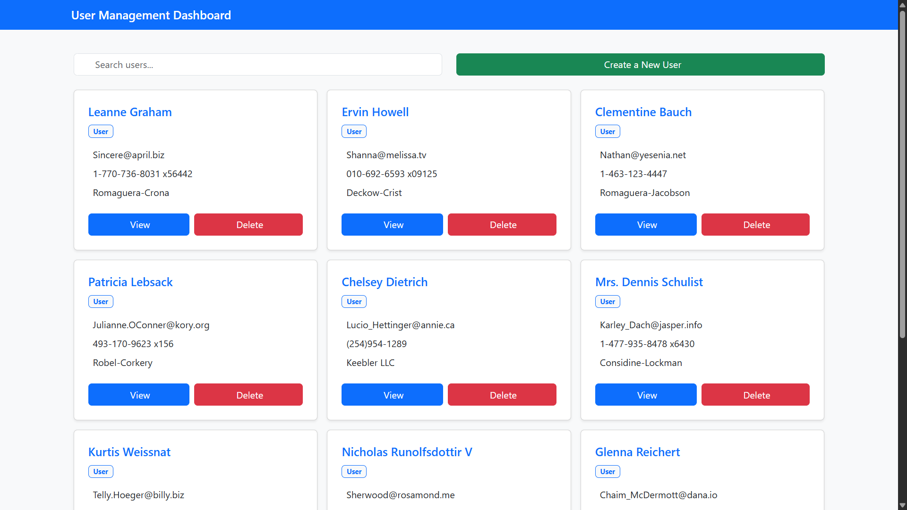
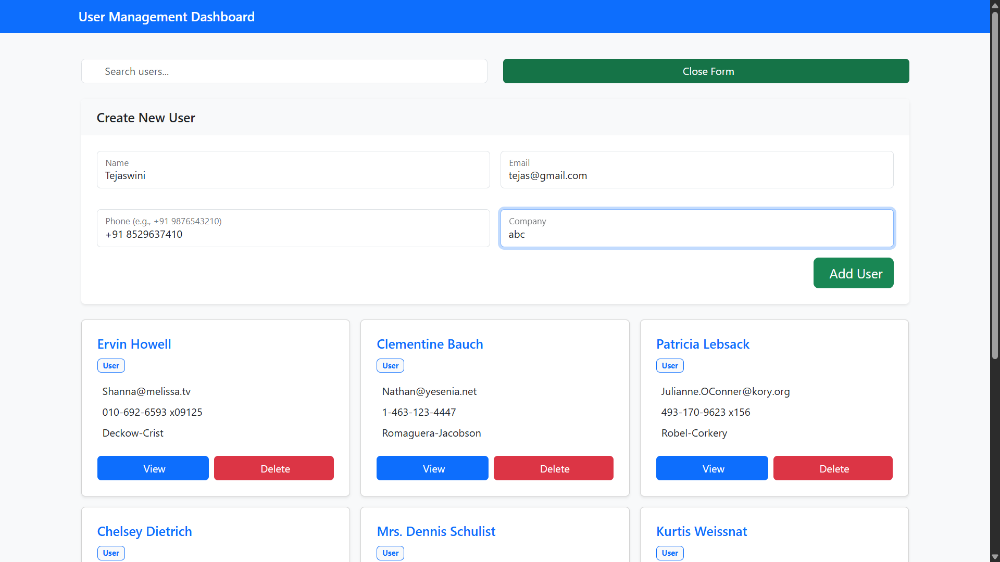
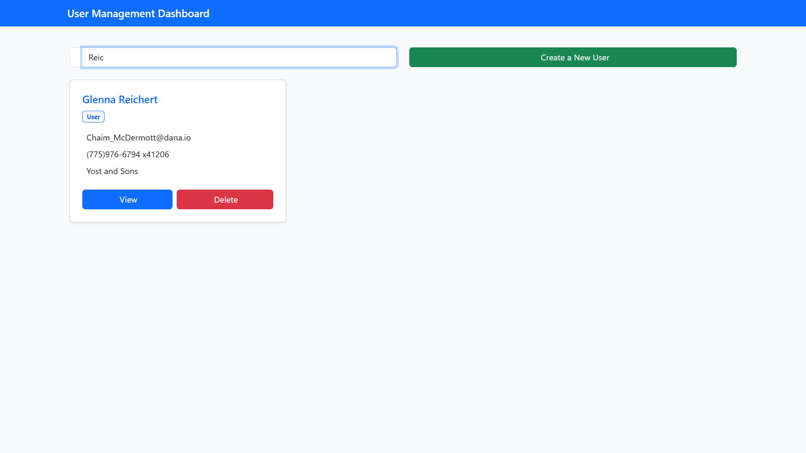
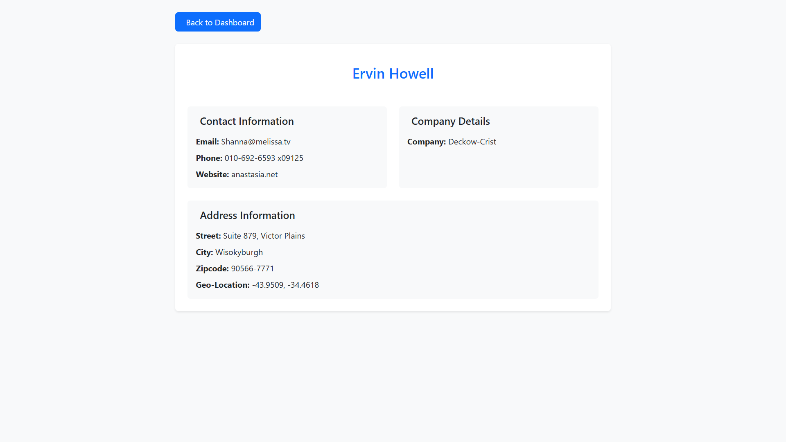
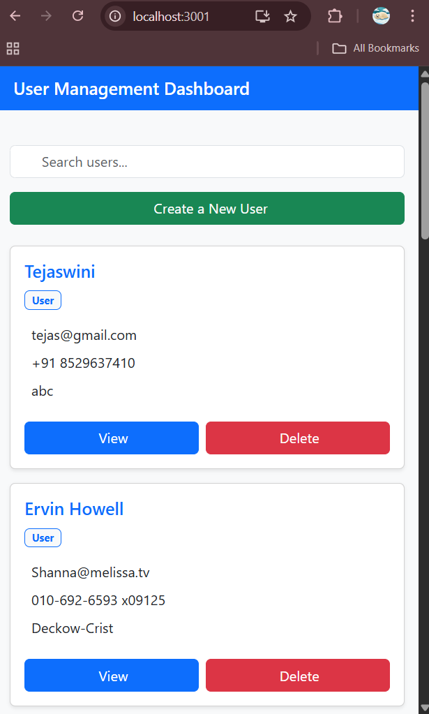
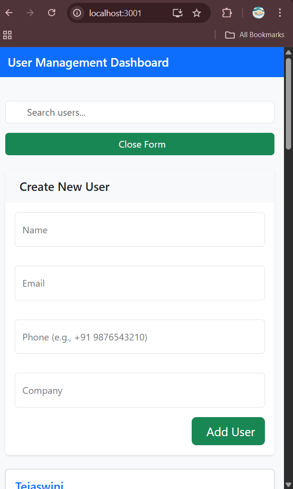

#  Welcome to My User Dashboard!

Hey there! I'm Tejaswini Koppada, and this is my React-based User Dashboard project. I built this as part of my frontend internship assignment, and I'm excited to share it with you!

##  What Can This App Do?

This dashboard isn't just any ordinary dashboard - it's a user-friendly interface where you can:
-  View all users in a clean, card-based layout
-  Search for users by their name (super handy when you have lots of users!)
-  Add new users with a simple form
-  Works perfectly on your phone or desktop
-  Click on any user to see their complete details

##  Here's What It Looks Like


- "Dashboard view showing user cards"


---

- "Create new user form"


---

-  "Search User"


---

- "User details page with full information"



  
- "Mobile view of the dashboard"




## 🛠️ Built With Cool Tech

- **React** - For building a snappy user interface
- **React Router** - Smooth navigation between pages
- **Bootstrap** - Making everything look good with minimal effort
- **Context API** - Managing our data like a boss
- **Axios** - Fetching data from the API

##  Want to Run It Locally?

It's super easy to get this up and running on your machine! Here's how:

1. **First, clone this repository:**
```bash
git clone [your-repository-url]
cd user-dashboard
```

2. **Install all the goodies:**
```bash
npm install
```

3. **Start the development server:**
```bash
npm start
```

4. **Open your browser and head to:**
```
http://localhost:3000
```

And voilà! You should see the dashboard in all its glory! 🎉

## 📁 How Everything is Organized


```
user-dashboard/
│
├── public/
│   └── index.html
│
├── src/
│   ├── assets/
│   │   └── screenshots
│
│   ├── components/
│   │   ├── UserCard.jsx
│   │   └── UserForm.jsx
│
│   ├── context/
│   │   └── UserContext.jsx
│
│   ├── pages/
│   │   ├── Dashboard.jsx
│   │   └── UserDetails.jsx
│
│   ├── App.jsx
│   ├── index.js
│   └── styles/
│       └── index.css
│
├── .gitignore
├── package.json
├── README.md

```


## 🌟 Features In Detail

### Dashboard Page
- Shows user cards with essential info
- Real-time search functionality
- Clean and intuitive interface
- Responsive grid layout

### User Details Page
- Comprehensive user information
- Address details with location
- Easy navigation back to dashboard

### Create User Form
- Simple and validated input fields
- Phone number format validation
- Instant feedback on submission

## 🔧 Technical Implementation

- Used functional components with React Hooks
- Implemented responsive design principles
- Global state management with Context API
- Clean and maintainable code structure

##  Mobile Responsiveness

The dashboard is fully responsive and works great on:
-  Smartphones
-  Tablets
-  Laptops
-  Desktop monitors

## ✨ What Makes This Project Special?

- Clean, modern UI design
- Smooth user experience
- Fast performance
- Well-organized code structure
- Comprehensive error handling

## 🤝 Want to Contribute?

Feel free to:
1. Fork the repository
2. Create your feature branch
3. Commit your changes
4. Push to the branch
5. Open a Pull Request

## 📫 Get in Touch

Created by Tejaswini Koppada
- GitHub: [@TejaswiniKoppada]([your-github-url](https://github.com/TejaswiniKoppada?tab=repositories))

## 📅 Last Updated
2025-08-06

## 📝 License

This project is open source and available under the [MIT License](LICENSE).

---

Hope you enjoy exploring this project as much as I enjoyed building it! If you have any questions or suggestions, feel free to reach out! 😊
